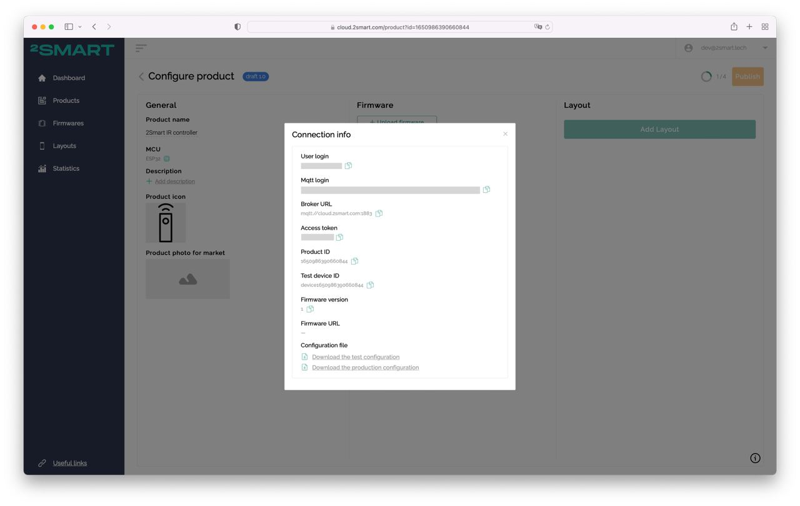

## 2Smart TV Control

This is a device to control TV with infrared diode via ESP32 dev board (ESP-WROOM-32). All the NEC-commands from original IR TV
remote control are defined in [ir-control.h](lib\ir-remote\node\ir-control.h)
The device supports full integration with the mobile application [2Smart Cloud](https://2smart.com) on [IOS](https://apps.apple.com/ru/app/2smart-cloud/id1539188825) and [Android](https://play.google.com/store/apps/details?id=com.smart.microcloud.app&hl=ru&gl=US).

The device firmware is developed based on the public [2Smart Cloud SDK](https://github.com/2SmartCloud/2smart-cloud-cpp-sdk) for ESP32.

## Configuration

Replace `product_id` in [src/main.h](./src/main.h) file with your own Product ID from "Connection info" modal.



## How to write firmware on device

### Using Docker (Linux only)
1. Download our bash script:
    ```
    curl https://raw.githubusercontent.com/2SmartCloud/2smart-cloud-cpp-sdk/master/utils/bin/firmware_install.sh > firmware_install.sh
    ```

2. Make script executable:
    ```
    chmod +x firmware_install.sh
    ```
3. Have connected device to your computer.

4. Build and write the firmware
    ```
    ./firmware_install.sh write -d <PORT>
    ```
    or update existing firmware
    ```
    ./firmware_install.sh upload -d <PORT>
    ```
    full list of commands
    ```
    ./firmware_install.sh
    ```

5. If everything is okay it should start in AP mode and blink once in a second.

### Using installed requirements
1. Need have:
    `python` (>= v3) installed. You can control it in terminal
    ```
    python --version
    ```

    `platformio` (>= v5.1.1)
    ```
    pip install -U platformio
    ```

2. Have connected device to your computer.

3. Device should be listed in /dev as one of this:

    ```
    (Linux)
    /dev/ttyUSB0

    (OSX)
    /dev/cu.SLAB_USBtoUART
    /dev/cu.usbserial-0001
    ```

4. build and write

    ```
    pio run -t uploadfs
    pio run -t upload
    ```

    or just build
    ```
    pio run
    ```

5. If everything is okay it should start in AP mode and blink once in a second.

If you have error "can't open device "/dev/ttyUSB0": Permission denied" follow Link https://qna.habr.com/q/526674

CLI guide https://docs.platformio.org/en/latest/core/userguide/index.html

## Custom firmware

Feel free to fork this firmware and create you own products with custom functionality.
Detailed instruction you could find in our [blog](https://2smart.com/blog/tpost/ebvsii6y21-how-to-write-firmware-for-an-iot-device).
